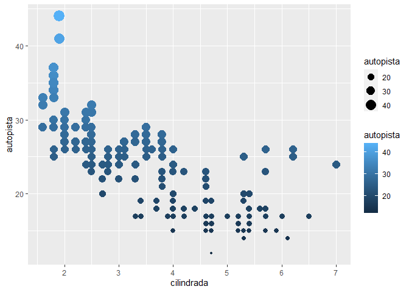
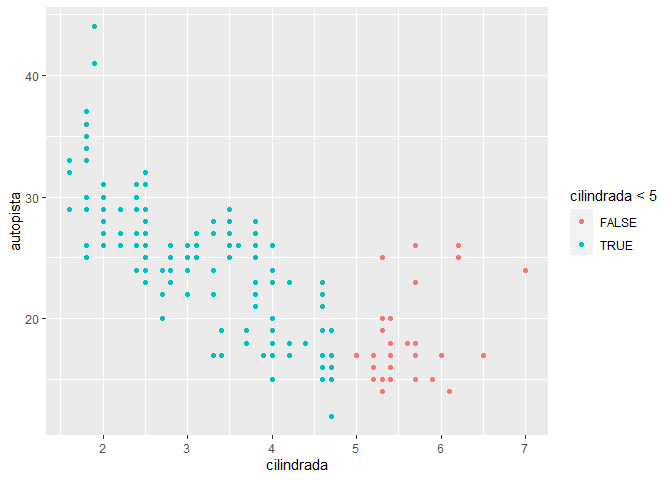
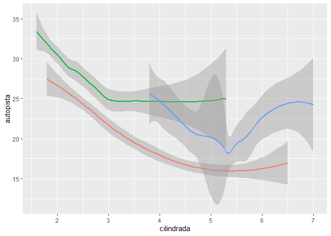
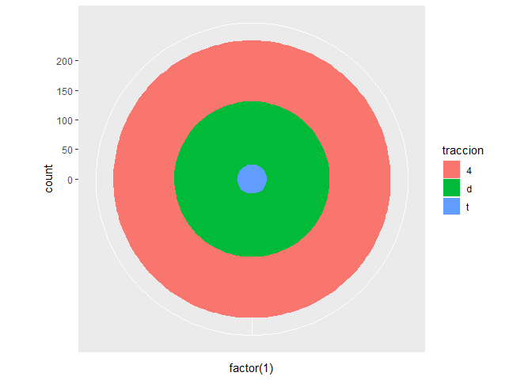
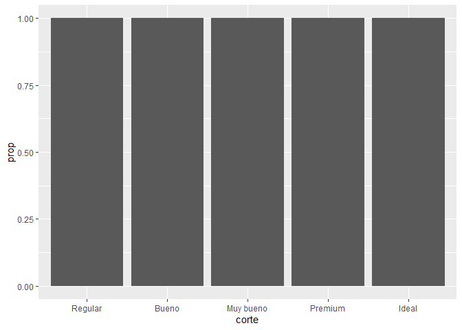
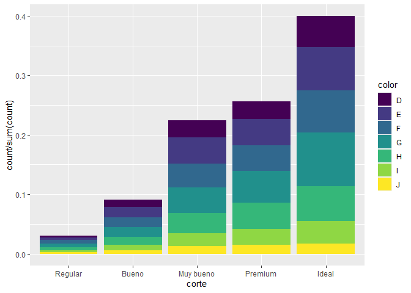
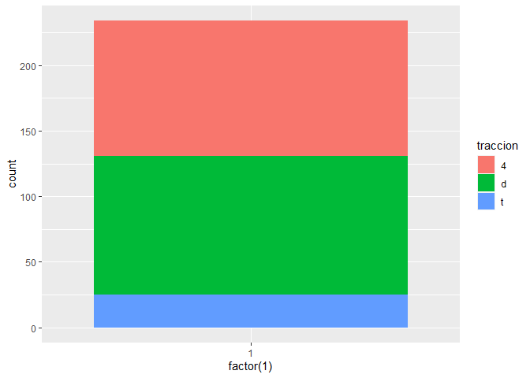
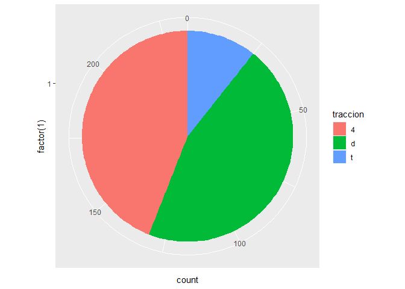

GGplot
================
Lliuya Anderson - Briceño Marlon - Lavado Kresly
28/1/2022

# 10.1 Parte 1: Ggplot base

``` r
library(tidyverse)
```

    ## Warning: package 'tidyverse' was built under R version 4.1.2

    ## Warning: package 'ggplot2' was built under R version 4.1.2

    ## Warning: package 'tidyr' was built under R version 4.1.2

    ## Warning: package 'readr' was built under R version 4.1.2

    ## Warning: package 'purrr' was built under R version 4.1.2

    ## Warning: package 'forcats' was built under R version 4.1.2

``` r
library(datos)
```

    ## Warning: package 'datos' was built under R version 4.1.2

# Ejecuta `ggplot(data = millas)`. ¿Qué observas?

``` r
ggplot(data = millas)
```

<!-- --> Se crea un
grafico vacio.

## ¿Cuántas filas hay en millas? ¿Cuántas columnas?

``` r
nrow(millas)
```

    ## [1] 234

``` r
ncol(millas)
```

    ## [1] 11

## ¿Qué describe la variable traccion? Lee la ayuda de ?millas para encontrar la respuesta.

``` r
unique(millas$traccion)
```

    ## [1] "d" "4" "t"

Clasifica los vehiculos en traccion trasera y delantera.

# Realiza un gráfico de dispersión de autopista versus cilindros.

``` r
ggplot(millas, aes(x = autopista, y = cilindros)) +
  geom_point()
```

<!-- -->

# ¿Qué sucede cuando haces un gráfico de dispersión (scatterplot) de clase versus traccion? ¿Por qué no es útil este gráfico?

``` r
ggplot(millas, aes(x = clase, y = traccion)) +
  geom_point()
```

<!-- --> El grafico
tien pocos puntos. Y las variables son categoricas.

# 10.2 Parte 2: Mapeos esteticos

## ¿Qué no va bien en este código? ¿Por qué hay puntos que no son azules?

``` r
   ggplot(data = millas) +
     geom_point(mapping = aes(x = cilindrada, y = autopista, color = "blue"))
```

<!-- --> Se debe
que el color esta dentro de aes() y lo considera como una variable.

``` r
ggplot(data = millas) +
     geom_point(mapping = aes(x = cilindrada, y = autopista), color = "blue")
```

<!-- --> ## ¿Qué
variables en millas son categóricas? ¿Qué variables son continuas?
(Pista: escribe ?millas para leer la documentación de ayuda para este
conjunto de datos). ¿Cómo puedes ver esta información cuando ejecutas
millas?

Asigna una variable continua a color, size, y shape. ¿Cómo se comportan
estas estéticas de manera diferente para variables categóricas y
variables continuas?

``` r
ggplot(millas, aes(x = cilindrada, y = autopista, colour = ciudad)) +
  geom_point()
```

<!-- -->

## ¿Qué ocurre si asignas o mapeas la misma variable a múltiples estéticas?

``` r
ggplot(millas, aes(x = cilindrada, y = autopista, colour = autopista, size = autopista)) +
  geom_point()
```

<!-- --> Va a
generar un grafico con información redundante .

## ¿Qué hace la estética stroke? ¿Con qué formas trabaja? (Pista: consulta ?geom_point)

``` r
ggplot(mtautos, aes(peso, millas)) +
  geom_point(shape = 21, colour = "black", fill = "white", size = 5, stroke = 5)
```

<!-- --> Cambia el
tamaño de las formas.

## ¿Qué ocurre si se asigna o mapea una estética a algo diferente del nombre de una variable, como aes(color = cilindrada \< 5)?

``` r
ggplot(millas, aes(x = cilindrada, y = autopista, colour = cilindrada < 5)) +
  geom_point()
```

<!-- --> Se crea una
variable temporal que da cuenta de la evaluacion de la variable.

# 10.3 Parte 3: Facetas

## ¿Qué ocurre si intentas separar en facetas una variable continua?

``` r
ggplot(millas, aes(x = cilindros, y = autopista)) +
  geom_point() +
  facet_grid(. ~ ciudad)
```

<!-- --> La variable
contia se vuelve variable categorica.

## ¿Qué significan las celdas vacías que aparecen en el gráfico generado usando facet_grid(traccion \~ cilindros)? ¿Cómo se relacionan con este gráfico?

``` r
   ggplot(data = millas) +
     geom_point(mapping = aes(x = traccion, y = cilindros))
```

``` r
ggplot(data = millas) +
  geom_point(mapping = aes(x = autopista, y = ciudad)) +
  facet_grid(traccion ~ cilindros)
```

<!-- --> Las
celdas vacias (facetas) en este grafico corresponden a combinaciones de
`traccion` y `cilindros` que no tienen observaciones.

## ¿Qué grafica el siguiente código? ¿Qué hace . ?

``` r
ggplot(data = millas) +
  geom_point(mapping = aes(x = cilindrada, y = autopista)) +
  facet_grid(traccion ~ .)
```

<!-- --> El simbolo
`.` ignora la dimension al momento de dibujar las facetas.

``` r
ggplot(data = millas) +
  geom_point(mapping = aes(x = cilindrada, y = autopista)) +
  facet_grid(. ~ cilindros)
```

<!-- -->
`. ~ cilindrada` va a dividir por los valores de `cyl` en el eje x.

### Mira de nuevo el primer gráfico en facetas presentado en esta sección:

# 10.4 Parte 4: Objetos

### ¿Qué geom usarías para generar un gráfico de líneas? ¿Y para un diagrama de caja? ¿Y para un histograma? ¿Y para un gráfico de área?

-   grafico de lieas: `geom_line()`
-   diagrama de caja: `geom_boxplot()`
-   histograma: `geom_histogram()`
-   grafico de area: `geom_area()`

## Ejecuta este código en tu mente y predice cómo se verá el output. Luego, ejecuta el código en R y verifica tus predicciones.

``` r
   ggplot(data = millas, mapping = aes(x = cilindrada, y = autopista, color = traccion)) +
     geom_point() +
     geom_smooth(se = FALSE)
```

El resultado es un diagrama de dispersion con `cilindrada` en el eje x,
`autopista` en el eje y los puntos pintados de acuerdo a `traccion`.
Tambien se incluiran una linea de tendencia, sin el error, para cada
grupo de `traccion`.

## ¿Qué muestra show.legend = FALSE? ¿Qué pasa si lo quitas? ¿Por qué crees que lo utilizamos antes en el capítulo?

``` r
ggplot(data = millas) +
  geom_smooth(
    mapping = aes(x = cilindrada, y = autopista, colour = traccion),
    show.legend = FALSE
  )
```

    ## `geom_smooth()` using method = 'loess' and formula 'y ~ x'

<!-- --> Quitar el
argumento `show.legend` o definir `show.legend = TRUE` mostrar la
relacion entre `traccion` y la paleta de colores. ## ¿Qué hace el
argumento se en geom_smooth()?

``` r
ggplot(data = millas, mapping = aes(x = cilindrada, y = autopista, colour = traccion)) +
  geom_point() +
  geom_smooth(se = TRUE)
```

    ## `geom_smooth()` using method = 'loess' and formula 'y ~ x'

<!-- --> Agrega
las bandas de error estandar a las lineas.

## ¿Se verán distintos estos gráficos? ¿Por qué sí o por qué no?

``` r
ggplot(data = millas, mapping = aes(x = cilindrada, y = autopista)) +
  geom_point() +
  geom_smooth()
```

    ## `geom_smooth()` using method = 'loess' and formula 'y ~ x'

<!-- -->

``` r
ggplot() +
  geom_point(data = millas, mapping = aes(x = cilindrada, y = autopista)) +
  geom_smooth(data = millas, mapping = aes(x = cilindrada, y = autopista))
```

    ## `geom_smooth()` using method = 'loess' and formula 'y ~ x'

<!-- -->
`geom_point()` y `geom_smooth()` toman los datos y estaticas de
`ggplot()`, por lo que no hace falta especificar lo mismo dos veces.

### Recrea el código R necesario para generar los siguientes gráficos:


# 10.6 Parte 6: Ajuste de posición

## ¿Cuál es el problema con este gráfico? ¿Cómo podrías mejorarlo?

``` r
   ggplot(data = millas, mapping = aes(x = ciudad, y = autopista)) +
     geom_point()
```

<!-- -->

``` r
ggplot(data = millas, mapping = aes(x = ciudad, y = autopista)) +
  geom_point(position = "jitter")
```

<!-- --> Existe
superposicion ya que hay multiples observaciones para cada combinacion
de `ciudad` y `autopista`.

#¿Qué parámetros de geom_jitter() controlan la cantidad de ruido? Los
valores por defecto de `width` y `height` introducen ruido en ambas
direcciones.

``` r
ggplot(data = millas, mapping = aes(x = ciudad, y = autopista)) +
  geom_point(position = position_jitter())
```

<!-- -->

Con `width = 0` se elimina la distorsion horizontal.

``` r
ggplot(data = millas, mapping = aes(x = ciudad, y = autopista)) +
  geom_jitter(width = 0)
```

<!-- -->

Con `width = 20` se agrega mucha distorsion.

``` r
ggplot(data = millas, mapping = aes(x = ciudad, y = autopista)) +
  geom_jitter(width = 20)
```

<!-- -->

#Compara y contrasta geom_jitter() con geom_count() `geom_jitter()`
agrega una variacion al azar a los puntos del grafico, es decir que
distorsiona la ubicacion de los puntos en el gráfico.

``` r
ggplot(data = millas, mapping = aes(x = ciudad, y = autopista)) +
  geom_jitter()
```

<!-- -->
`geom_count()` cambia el tamano de los puntos relativo a la cantidad de
observaciones. Las combinaciones de `x` e `y` con mas observaciones
tendran un mayor tamaño. Esto no distorsiona los valores, pero tiene el
problema de que el tamaño de los puntos puede generar superposicion si
los puntos son cercanos.

``` r
ggplot(data = millas, mapping = aes(x = ciudad, y = autopista)) +
  geom_count()
```

<!-- -->

#¿Cuál es el ajuste de posición predeterminado de geom_boxplot()? Crea
una visualización del conjunto de datos de millas que lo demuestre.

La posicion por defecto para `geom_boxplot()` es `"dodge2"`, que es un
atajo de `position_dodge2`. Mueve las geometrias horizontalmente para
evitar la superposicion. Si agregamos `colour = clase` a un diagrama de
cajas, los niveles de `transmision` se ubican lado a lado.

``` r
ggplot(data = millas, aes(x = transmision, y = autopista, colour = clase)) +
  geom_boxplot()
```

<!-- -->

Si se usa `position_identity()` habra superposicion.

``` r
ggplot(data = millas, aes(x = transmision, y = autopista, colour = clase)) +
  geom_boxplot(position = "identity")
```

<!-- -->

# 10.7 Parte 7: Sistema de coordenadas

### Convierte un gráfico de barras apiladas en un gráfico circular usando coord_polar().

Un grafico de torta es un grafico de barras aplicadas con la adicion de
coordenadas polares.

Partamos del siguiente ejemplo:

``` r
ggplot(millas, aes(x = factor(1), fill = traccion)) +
  geom_bar()
```

<!-- -->

Ahora agregamos `coord_polar(theta="y")` para crear el grafico de torta:

``` r
ggplot(millas, aes(x = factor(1), fill = traccion)) +
  geom_bar(width = 1) +
  coord_polar(theta = "y")
```

<!-- -->

El argumento `theta = "y"` transforma `y` en el ángulo de cada seccion.
Si `coord_polar()` se especifica sin `theta = "y"`, el resultado se
llama “ojo de buey”.

``` r
ggplot(millas, aes(x = factor(1), fill = traccion)) +
  geom_bar(width = 1) +
  coord_polar()
```

<!-- -->

### ¿Qué hace labs()? Lee la documentación.

`labs` agrega los titulos de los ejes, titulo del grafico y la leyenda.

``` r
ggplot(data = millas, mapping = aes(x = clase, y = autopista)) +
  geom_boxplot() +
  coord_flip() +
  labs(y = "Millas por Galón en Autopista",
       x = "Clase",
       title = "Millas por Galón en Autopista por Tipo de Vehículo",
       subtitle = "1999-2008",
       caption = "Fuente: http://fueleconomy.gov")
```

<!-- -->

`labs()` no es la unica funcion para agregar titulos. `xlab()`, `ylab()`
y `ggtitle()` realizan la misma funcion.

#¿Cuál es la diferencia entre coord_quickmap() y coord_map()?
`coord_map()` usa una proyeccion cartografica para proyectar la Tierra
sobre una superficie bidimensional. `coord_quickmap()` usa una
aproximacion mas rapida que ignora la curvatura de la tierra y ajusta de
acuerdo a la razon de latitud y longitud. Esta es una alternativa
computacionalmente más rapida que no genera la necesidad de transformar
las geometrias individuales.

#¿Qué te dice la gráfica siguiente sobre la relación entre ciudad y
autopista? ¿Por qué es coord_fixed() importante? ¿Qué hace
geom_abline()?

La función `coord_fixed()` asegura que la linea que gener
`geom_abline()` tenga un angulo de 45 grados. De este modo es mas facil
comparar a partir de los casos en que los rendimientos en autopista y
ciudad son iguales.

``` r
ggplot(data = millas, mapping = aes(x = ciudad, y = autopista)) +
  geom_point() +
  geom_abline() +
  coord_fixed()
```

<!-- -->

# 10.5 PARTE 5

### 1.- ¿Cuál es el geom predeterminado asociado con `stat_summary()`?

### ¿Cómo podrías reescribir el gráfico anterior para usar esa función geom en lugar de la función stat?

EL GRAFICO

``` r
ggplot(data = diamantes) +
  stat_summary(
    mapping = aes(x = corte, y = profundidad),
    fun.ymin = min,
    fun.ymax = max,
    fun.y = median
  )
```

    ## Warning: `fun.y` is deprecated. Use `fun` instead.

    ## Warning: `fun.ymin` is deprecated. Use `fun.min` instead.

    ## Warning: `fun.ymax` is deprecated. Use `fun.max` instead.

<!-- --> ### 2.-
¿Qué hace geom_col()? ¿En qué se diferencia de geom_bar()?

El estadistico por defecto en `geom_col()` es distinto de `geom_bar()`.

`geom_col()` usa `stat_identity()`, que deja los datos sin transformar.

`geom_col()` espera que los datos contengan los valores de `x` y los
valores de `y` que representan la altura de las columnas.

`geom_bar()` usa `stat_bin()` y espera únicamente los valores de `x`.

`stat_bin()`, procesa los datos de entrada y realiza un conteo del
número de observaciones para cada valor de `x`, lo cual genera la
variable `y` internamente.

### 3.- La mayoría de los geoms y las transformaciones estadísticas vienen en pares que casi siempre se usan en conjunto. Lee la documentación y haz una lista de todos los pares.

¿Qué tienen en común?

| Geometría           | Estadistico         |
|---------------------|---------------------|
| `geom_bar()`        | `stat_count()`      |
| `geom_bin2d()`      | `stat_bin_2d()`     |
| `geom_boxplot()`    | `stat_boxplot()`    |
| `geom_contour()`    | `stat_contour()`    |
| `geom_count()`      | `stat_sum()`        |
| `geom_density()`    | `stat_density()`    |
| `geom_density_2d()` | `stat_density_2d()` |
| `geom_hex()`        | `stat_hex()`        |
| `geom_freqpoly()`   | `stat_bin()`        |
| `geom_histogram()`  | `stat_bin()`        |
| `geom_qq_line()`    | `stat_qq_line()`    |
| `geom_qq()`         | `stat_qq()`         |
| `geom_quantile()`   | `stat_quantile()`   |
| `geom_smooth()`     | `stat_smooth()`     |
| `geom_violin()`     | `stat_violin()`     |
| `geom_sf()`         | `stat_sf()`         |

Los nombres tienen a ser similares, por ejemplo `geom_smooth()` y
`stat_smooth()`, aunque hay casos como `geom_bar()` y `stat_count()`.

La mayoria de las geometria usa por defecto el estadisticos que le
corresponde en la tabla anterior.Reciprocamente, la mayoria de los
estadisticos usan por defecto la geometría que le corresponde en la
tabla anterior. Las siguientes tablas contienen las geometrias y
estadisticos en [ggplot2](https://ggplot2.tidyverse.org/reference/). \|
geometricas \|estadisticos por defecto\| documentacion conjunta \|
\|:——————–\|:———————–\|————————\| \| `geom_abline()` \| \| \| \|
`geom_hline()` \| \| \| \| `geom_vline()` \| \| \| \| `geom_bar()` \|
`stat_count()` \| x \| \| `geom_col()` \| \| \| \| `geom_bin2d()` \|
`stat_bin_2d()` \| x \| \| `geom_blank()` \| \| \| \| `geom_boxplot()`
\| `stat_boxplot()` \| x \| \| `geom_countour()` \| `stat_countour()` \|
x \| \| `geom_count()` \| `stat_sum()` \| x \| \| `geom_density()` \|
`stat_density()` \| x \| \| `geom_density_2d()` \| `stat_density_2d()`
\| x \| \| `geom_dotplot()` \| \| \| \| `geom_errorbarh()` \| \| \| \|
`geom_hex()` \| `stat_hex()` \| x \| \| `geom_freqpoly()` \|
`stat_bin()` \| x \| \| `geom_histogram()` \| `stat_bin()` \| x \| \|
`geom_crossbar()` \| \| \| \| `geom_errorbar()` \| \| \| \|
`geom_linerange()` \| \| \| \| `geom_pointrange()` \| \| \| \|
`geom_map()` \| \| \| \| `geom_point()` \| \| \| \| `geom_map()` \| \|
\| \| `geom_path()` \| \| \| \| `geom_line()` \| \| \| \| `geom_step()`
\| \| \| \| `geom_point()` \| \| \| \| `geom_polygon()` \| \| \| \|
`geom_qq_line()` \| `stat_qq_line()` \| x \| \| `geom_qq()` \|
`stat_qq()` \| x \| \| `geom_quantile()` \| `stat_quantile()` \| x \| \|
`geom_ribbon()` \| \| \| \| `geom_area()` \| \| \| \| `geom_rug()` \| \|
\| \| `geom_smooth()` \| `stat_smooth()` \| x \| \| `geom_spoke()` \| \|
\| \| `geom_label()` \| \| \| \| `geom_text()` \| \| \| \|
`geom_raster()` \| \| \| \| `geom_rect()` \| \| \| \| `geom_tile()` \|
\| \| \| `geom_violin()` \| `stat_ydensity()` \| x \| \| `geom_sf()` \|
`stat_sf()` \| x \|

Tabla: ggplot2 capas de geometrías y sus estadisticas por defecto.

| estadistico          | Geometria por defecto | Documentacion conjunta |
|:---------------------|:----------------------|------------------------|
| `stat_ecdf()`        | `geom_step()`         |                        |
| `stat_ellipse()`     | `geom_path()`         |                        |
| `stat_function()`    | `geom_path()`         |                        |
| `stat_identity()`    | `geom_point()`        |                        |
| `stat_summary_2d()`  | `geom_tile()`         |                        |
| `stat_summary_hex()` | `geom_hex()`          |                        |
| `stat_summary_bin()` | `geom_pointrange()`   |                        |
| `stat_summary()`     | `geom_pointrange()`   |                        |
| `stat_unique()`      | `geom_point()`        |                        |
| `stat_count()`       | `geom_bar()`          | x                      |
| `stat_bin_2d()`      | `geom_tile()`         | x                      |
| `stat_boxplot()`     | `geom_boxplot()`      | x                      |
| `stat_countour()`    | `geom_contour()`      | x                      |
| `stat_sum()`         | `geom_point()`        | x                      |
| `stat_density()`     | `geom_area()`         | x                      |
| `stat_density_2d()`  | `geom_density_2d()`   | x                      |
| `stat_bin_hex()`     | `geom_hex()`          | x                      |
| `stat_bin()`         | `geom_bar()`          | x                      |
| `stat_qq_line()`     | `geom_path()`         | x                      |
| `stat_qq()`          | `geom_point()`        | x                      |
| `stat_quantile()`    | `geom_quantile()`     | x                      |
| `stat_smooth()`      | `geom_smooth()`       | x                      |
| `stat_ydensity()`    | `geom_violin()`       | x                      |
| `stat_sf()`          | `geom_rect()`         | x                      |

### 4.- ¿Qué variables calcula stat_smooth()?

¿Qué parámetros controlan su comportamiento?

La funcion`stat_smooth()` calcula las siguientes variables:

-   `y`: valor predicho
-   `ymin`: menor valor del intervalo de confianza
-   `ymax`: mayor valor del intervalo de confianza
-   `se`: error estándar

La seccion “Computed Variables” en la documentación de `stat_smooth()`
contiene estas variables.

Los parametros que controlan `stat_smooth()` incluyen

-   `method`: cual metodo utilizar
-   `formula`: las formulas, al igual que `method`, determinan como se
    hará el cálculo del intervalo de confianza y los argumentos
    adicionales que se requieran.
-   `na.rm`: si acaso se eliminaron los casos perdidos

### 5.- En nuestro gráfico de barras de proporción necesitamos establecer group = 1

### ¿Por qué?

### En otras palabras, ¿cuál es el problema con estos dos gráficos?

``` r
   ggplot(data = diamantes) +
     geom_bar(mapping = aes(x = corte, y = ..prop..))
   
   ggplot(data = diamantes) +
     geom_bar(mapping = aes(x = corte, fill = color, y = ..prop..))
```

Si no se incluye `group = 1`, todas las baras en el grafico tendrán
altura 1.

La funcion `geom_bar()` asume que los grupos son iguales a los valores
de `x` dado que el estadistico realiza un conteo dentro de los grupos.

``` r
ggplot(data = diamantes) +
  geom_bar(mapping = aes(x = corte, y = ..prop..))
```

<!-- -->

El problema con estos gráficos es que las proporciones se calculan
dentro de los grupos.

``` r
ggplot(data = diamantes) +
  geom_bar(mapping = aes(x = corte, y = ..prop..))
```

<!-- -->

``` r
ggplot(data = diamantes) +
  geom_bar(mapping = aes(x = corte, fill = color, y = ..prop..))
```

<!-- -->

El siguiente código generará el gráfico buscado sin relleno.

``` r
ggplot(data = diamantes) +
  geom_bar(mapping = aes(x = corte, y = ..prop.., group = 1))
```

<!-- -->

Con el argumento `fill`, es necesario normalizar las barras.

``` r
ggplot(data = diamantes) + 
  geom_bar(aes(x = corte, y = ..count.. / sum(..count..), fill = color))
```

<!-- --> #10.6
PARTE 6: Ajuste de posición ### 1.- ¿Cuál es el problema con este
gráfico? ¿Cómo podrías mejorarlo?

``` r
   ggplot(data = millas, mapping = aes(x = ciudad, y = autopista)) +
     geom_point()
```

<!-- --> Existe
superacion ya que hay multiples observaciones para cada combinacion de
`ciudad` y `autopista`.

Se puede mejorar el grafico usando el argumento de distorsion y hace
reducir la superacion.

``` r
ggplot(data = millas, mapping = aes(x = ciudad, y = autopista)) +
  geom_point(position = "jitter")
```

<!-- -->

La relacion entre `ciudad` y `autopista` es clara, incluso sin el
argumento de distorsion, que en este caso deja en claro donde se
concentran las observaciones. ### 2.- ¿Qué parámetros de geom_jitter()
controlan la cantidad de ruido? A partir de la documentacion de
[`geom_jitter()`](https://ggplot2.tidyverse.org/reference/geom_jitter.html),
existen dos argumentos:

-   `width` controla el desplazamiento vertical
-   `height` controla el desplazamiento horizontal

Los valores por defecto de `width` y `height` introducen ruido en ambas
direcciones.

Ahi se ve el grafico con las opciones por defecto.

``` r
ggplot(data = millas, mapping = aes(x = ciudad, y = autopista)) +
  geom_point(position = position_jitter())
```

<!-- -->

Con `width = 0` se elimina la distorsion horizontal.

``` r
ggplot(data = millas, mapping = aes(x = ciudad, y = autopista)) +
  geom_jitter(width = 0)
```

<!-- -->

Con `width = 20` se agrega mucha distorsion.

``` r
ggplot(data = millas, mapping = aes(x = ciudad, y = autopista)) +
  geom_jitter(width = 20)
```

<!-- -->

Es analogo de `height`.

Hay que notar que `width` y `height` se expresan en las mismas unidades
que los datos, por lo que `height = 1` o `width = 1` corresponden a
diferentes valores relativos de distorsion dependiendo de las escalas de
`x` e `y`.

Los valores por defecto son 80% de la resolucion(`resolution()`) de los
datos. Cuando `x` e `y` son discretas, su resolucion es igual a uno, y
los valores por defecto son `height = 0.4` y `width = 0.4` ya que la
distorcion mueve los puntos en direccion positiva y negativa. ### 3.-
Compara y contrasta geom_jitter() con geom_count() `geom_jitter()`
agrega una variacion al azar a los puntos del gráfico., es decir que
distorsiona la ubicacion de los puntos en el gráfico. Este metodo reduce
la superposicion ya que es poco probable que al mover los puntos al azar
estos queden en la misma ubicacion. Sin embargo, el problema de reducir
la superposición es que se distorsionan los valores mostrados de `x` e
`y`.

``` r
ggplot(data = millas, mapping = aes(x = ciudad, y = autopista)) +
  geom_jitter()
```

<!-- -->

`geom_count()` cambia el tamaño de los puntos relativo a la cantidad de
observaciones. Las combinaciones de `x` e `y` con más observaciones
tendran un mayor tamaño. Esto no distorsiona los valores, pero tiene el
problema de que el tamaño de los puntos puede generar superacion si los
puntos son cercanos.

``` r
ggplot(data = millas, mapping = aes(x = ciudad, y = autopista)) +
  geom_count()
```

<!-- -->

Por ejemplo, `geom_count()` puede ser menos legible que `geom_jitter()`
si se agrega un argumento de color.

``` r
ggplot(data = millas, mapping = aes(x = ciudad, y = autopista, color = clase)) +
  geom_jitter()
```

<!-- -->

``` r
ggplot(data = millas, mapping = aes(x = ciudad, y = autopista, color = clase)) +
  geom_count()
```

<!-- -->

Este ejemplo muestra que no existe una solucion universal. El coste y
beneficio de cada enfoque depende de la estructura de los datos y del
objetivo.

### 4.-¿Cuál es el ajuste de posición predeterminado de geom_boxplot()? Crea una visualización del conjunto de datos de millas que lo demuestre.

La posicion por defecto para `geom_boxplot()` es `"dodge2"`, que es un
atajo de `position_dodge2`.

Este ajuste no cambia la posición vertical pero mueve las geometrias
horizontalmente para evitar la superposicion.

Consulta la documentación de
[`position_dodge2()`](https://ggplot2.tidyverse.org/reference/position_dodge.html)
para los detalles especificados.

Si agregamos `colour = clase` a un diagrama de cajas, los niveles de
`transmision` se ubican lado a lado.

``` r
ggplot(data = millas, aes(x = transmision, y = autopista, colour = clase)) +
  geom_boxplot()
```

<!-- -->

Si se usa `position_identity()` habra superposicion.

``` r
ggplot(data = millas, aes(x = transmision, y = autopista, colour = clase)) +
  geom_boxplot(position = "identity")
```

<!-- --> #10.7
PARTE 7: Ajuste de posición ### 1.-Convierte un gráfico de barras
apiladas en un gráfico circular usando coord_polar().

``` r
ggplot(millas, aes(x = factor(1), fill = traccion)) +
  geom_bar()
```

<!-- -->

``` r
ggplot(millas, aes(x = factor(1), fill = traccion)) +
  geom_bar(width = 1) +
  coord_polar(theta = "y")
```

<!-- -->

``` r
ggplot(millas, aes(x = factor(1), fill = traccion)) +
  geom_bar(width = 1) +
  coord_polar()
```

<!-- -->

### 2.-¿Qué hace labs()? Lee la documentación.

`labs` agrega los titulos de los ejes, titulo del grafico y la leyenda.

``` r
ggplot(data = millas, mapping = aes(x = clase, y = autopista)) +
  geom_boxplot() +
  coord_flip() +
  labs(y = "Millas por Galón en Autopista",
       x = "Clase",
       title = "Millas por Galón en Autopista por Tipo de Vehículo",
       subtitle = "1999-2008",
       caption = "Fuente: http://fueleconomy.gov")
```

<!-- -->

`labs()` no es la unica funcion para agregar titulos. `xlab()`, `ylab()`
y `ggtitle()` realizan la misma función.

### 3.-¿Cuál es la diferencia entre coord_quickmap() y coord_map()?

`coord_map()` usa una proyección cartográfica para proyectar la Tierra
sobre una superficie bidimensional. Por defecto usa la [Proyeccion de
Mercator](https://es.wikipedia.org/wiki/Proyecci%C3%B3n_de_Mercator), la
cual se aplica a todas las geometrias del grafico.

`coord_quickmap()` usa una aproximacion mas rapida que ignora la
curvatura de la tierra y ajusta de acuerdo a la razon de latitud y
longitud. Esta es una alternativa computacionalmente mas rapida que no
genera la necesidad de transformar las geometrias individuales.

### 4.-¿Qué te dice la gráfica siguiente sobre la relación entre ciudad y autopista? ¿Por qué es coord_fixed() importante? ¿Qué hace geom_abline()?

``` r
   ggplot(data = millas, mapping = aes(x = ciudad, y = autopista)) +
     geom_point() +
     geom_abline() +
     coord_fixed()
```


La funcion `coord_fixed()` asegura que la linea que genera
`geom_abline()` tenga un angulo de 45 grados. De este modo es mas facil
comparar a partir de los casos en que los rendimientos en autopista y
ciudad son iguales.

``` r
ggplot(data = millas, mapping = aes(x = ciudad, y = autopista)) +
  geom_point() +
  geom_abline() +
  coord_fixed()
```

<!-- -->

Todos los modelos el rendimiento en autopista es superior al rendmiento
en ciudad.
