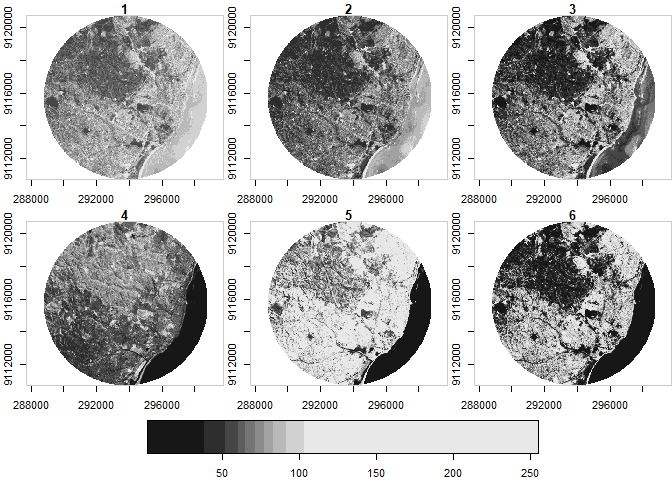

Stars
================
Marlon Gonzalo Briceño Cárdenas
31/1/2022

# Stars:

-   Permite analizar cubos de datos raster y vectoriales, proporciona
    una salida integracion de funciones raster en la libreria GDAL,
    proporciona una integración con el paquete “sf” y sigue los
    principios de diseño “tidyverse”.

-   Cubos de datos: Datos vectoriales”sf”, datos raster “raster”

-   Diferencias entre raster, terra vs stars

-   Stars puede contener metadatos raster.Está estrechamente integrado
    con el análisis de capas vectoriales en el paquete sf.Pueden tener
    más que tres dimensiones.

-   RASTER & TERRA No puede contener metadatos raster.Están menos
    integrado con el paquete sf .Puede usar las funciones de filtro
    focal.Están limitadas a solo tres dimensiones.

### 1.- Instalación

`install.packages("stars",dependencies=T)`

``` r
library(stars)
```

    ## Warning: package 'stars' was built under R version 4.1.2

    ## Loading required package: abind

    ## Loading required package: sf

    ## Warning: package 'sf' was built under R version 4.1.2

    ## Linking to GEOS 3.9.1, GDAL 3.2.1, PROJ 7.2.1; sf_use_s2() is TRUE

``` r
  tif = system.file("tif/L7_ETMs.tif",
  package = "stars") 
r = read_stars(tif)
  plot(r, axes = TRUE)
```

<!-- --> ###
3.-Tipos de Matriz \* Regular

``` r
x = 1:5
y = 1:4
d = st_dimensions(x = x, y = y, .raster = c("x", "y"))
m = matrix(runif(20),5,4)
r1 = st_as_stars(r = m, dimensions = d)
```

-   Rotate

``` r
r = attr(d, "raster")
r$affine = c(0.2, -0.2)
attr(d,"raster") = r
r2 = st_as_stars(r = m, dimensions = d)
```

-   Sheared

``` r
r = attr(d, "raster")
r$affine = c(0.1, -0.3)
attr(d,"raster") = r
r3 = st_as_stars(r = m, dimensions = d)
```

-   Rectilinear

``` r
X = c(1, 2, 3.5, 5, 6)
Y = c(1, 1.5, 3, 3.5)
d = st_dimensions(x = x, y = y, .raster = c("x", "y"))
r4 = st_as_stars(r = m , dimensions = d)
```

-   Curvilinear

``` r
grd = st_make_grid(cellsize = c(10,10), offset = c(-130,10) 
    ,n= c(8,5), crs = st_crs(4326))
r5 = st_transform(grd, "proj = laea + lon_0=-70 +lat_0=35")
```

    ## Error in CPL_transform(x, crs, aoi, pipeline, reverse, desired_accuracy, : crs not found: is it missing?

### Ploteo y dimensiones:

``` r
x= read_stars(tif)
plot(x[,,,],axes = T)
```

<!-- -->

``` r
circle = st_sfc(st_buffer(st_point(c(293749, 9115745)),
5000), crs = st_crs(x))
plot(x[circle][, , , ],reset = FALSE, axes=T )
```

<!-- --> ###
Punto o banda en específico:

``` r
plot(x[circle][, , , 1],reset = FALSE, axes=T )
plot(circle, col = NA, border = 'red', add = TRUE, lwd =3 )
```

<!-- -->
