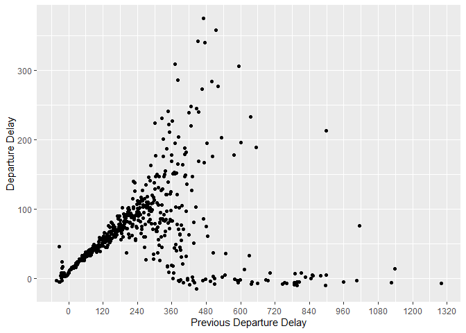
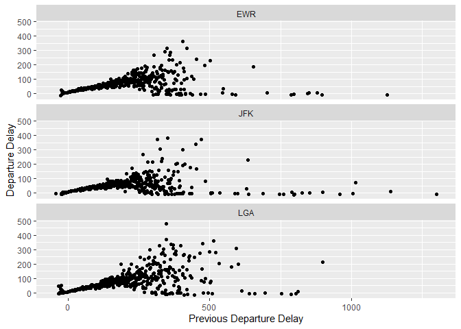
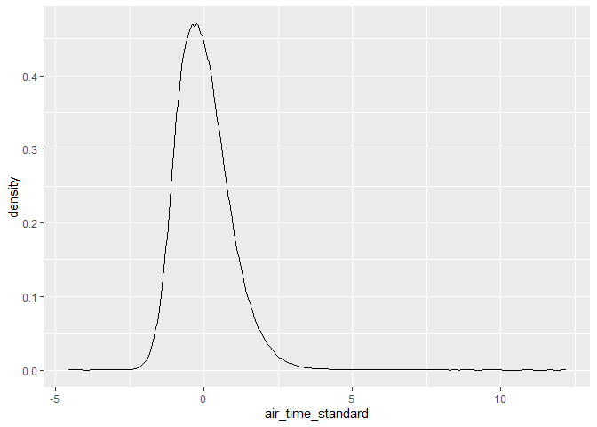
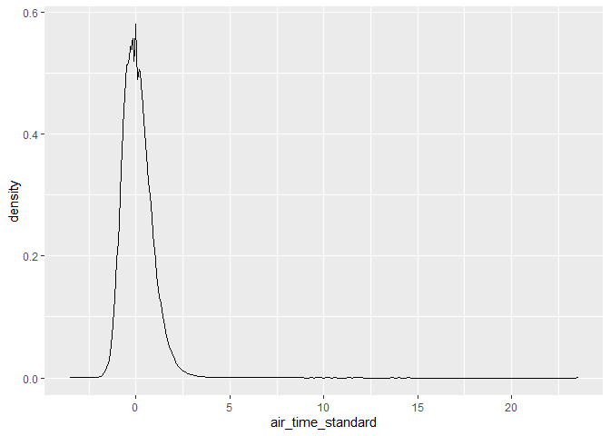
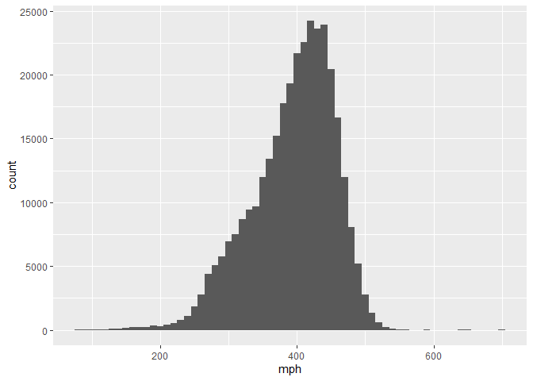

tidyverse
================
Marlon Gonzalo Briceño Cárdenas
18/1/2022

# *Ejercicios tidyverse*

## **1.Parte 1: Dplyr - filter**

### Encuentra todos los vuelos que:

-   Tuvieron un retraso de llegada de dos o más horas

``` r
library(nycflights13)
```

    ## Warning: package 'nycflights13' was built under R version 4.1.2

``` r
library(tidyverse)
```

    ## Warning: package 'tidyverse' was built under R version 4.1.2

    ## -- Attaching packages --------------------------------------- tidyverse 1.3.1 --

    ## v ggplot2 3.3.5     v purrr   0.3.4
    ## v tibble  3.1.5     v dplyr   1.0.7
    ## v tidyr   1.1.4     v stringr 1.4.0
    ## v readr   2.1.0     v forcats 0.5.1

    ## Warning: package 'ggplot2' was built under R version 4.1.2

    ## Warning: package 'tidyr' was built under R version 4.1.2

    ## Warning: package 'readr' was built under R version 4.1.2

    ## Warning: package 'purrr' was built under R version 4.1.2

    ## Warning: package 'forcats' was built under R version 4.1.2

    ## -- Conflicts ------------------------------------------ tidyverse_conflicts() --
    ## x dplyr::filter() masks stats::filter()
    ## x dplyr::lag()    masks stats::lag()

``` r
data("flights")
Vuelos_2hde_retraso<-flights%>%filter(arr_delay>=120)
Vuelos_2hde_retraso
```

    ## # A tibble: 10,200 x 19
    ##     year month   day dep_time sched_dep_time dep_delay arr_time sched_arr_time
    ##    <int> <int> <int>    <int>          <int>     <dbl>    <int>          <int>
    ##  1  2013     1     1      811            630       101     1047            830
    ##  2  2013     1     1      848           1835       853     1001           1950
    ##  3  2013     1     1      957            733       144     1056            853
    ##  4  2013     1     1     1114            900       134     1447           1222
    ##  5  2013     1     1     1505           1310       115     1638           1431
    ##  6  2013     1     1     1525           1340       105     1831           1626
    ##  7  2013     1     1     1549           1445        64     1912           1656
    ##  8  2013     1     1     1558           1359       119     1718           1515
    ##  9  2013     1     1     1732           1630        62     2028           1825
    ## 10  2013     1     1     1803           1620       103     2008           1750
    ## # ... with 10,190 more rows, and 11 more variables: arr_delay <dbl>,
    ## #   carrier <chr>, flight <int>, tailnum <chr>, origin <chr>, dest <chr>,
    ## #   air_time <dbl>, distance <dbl>, hour <dbl>, minute <dbl>, time_hour <dttm>

``` r
#Nuemro de vuelos con 2h a más horas de retraso 
count(Vuelos_2hde_retraso)
```

    ## # A tibble: 1 x 1
    ##       n
    ##   <int>
    ## 1 10200

-   Volaron a Houston (IAH o HOU)

``` r
Detino_HOU_y_IAH<-flights%>%filter(dest==c("HOU","IAH"))
Detino_HOU_y_IAH
```

    ## # A tibble: 4,658 x 19
    ##     year month   day dep_time sched_dep_time dep_delay arr_time sched_arr_time
    ##    <int> <int> <int>    <int>          <int>     <dbl>    <int>          <int>
    ##  1  2013     1     1      533            529         4      850            830
    ##  2  2013     1     1      728            732        -4     1041           1038
    ##  3  2013     1     1      739            739         0     1104           1038
    ##  4  2013     1     1      908            908         0     1228           1219
    ##  5  2013     1     1     1044           1045        -1     1352           1351
    ##  6  2013     1     1     1205           1200         5     1503           1505
    ##  7  2013     1     1     1248           1250        -2     1607           1607
    ##  8  2013     1     1     1356           1350         6     1659           1640
    ##  9  2013     1     1     1430           1430         0     1735           1744
    ## 10  2013     1     1     1702           1700         2     2044           2028
    ## # ... with 4,648 more rows, and 11 more variables: arr_delay <dbl>,
    ## #   carrier <chr>, flight <int>, tailnum <chr>, origin <chr>, dest <chr>,
    ## #   air_time <dbl>, distance <dbl>, hour <dbl>, minute <dbl>, time_hour <dttm>

-   Partieron en invierno del hemisferio sur (julio, agosto y
    septiembre)

``` r
Salida_invierno<-flights%>%filter(month<10 & month>6)
Salida_invierno
```

    ## # A tibble: 86,326 x 19
    ##     year month   day dep_time sched_dep_time dep_delay arr_time sched_arr_time
    ##    <int> <int> <int>    <int>          <int>     <dbl>    <int>          <int>
    ##  1  2013     7     1        1           2029       212      236           2359
    ##  2  2013     7     1        2           2359         3      344            344
    ##  3  2013     7     1       29           2245       104      151              1
    ##  4  2013     7     1       43           2130       193      322             14
    ##  5  2013     7     1       44           2150       174      300            100
    ##  6  2013     7     1       46           2051       235      304           2358
    ##  7  2013     7     1       48           2001       287      308           2305
    ##  8  2013     7     1       58           2155       183      335             43
    ##  9  2013     7     1      100           2146       194      327             30
    ## 10  2013     7     1      100           2245       135      337            135
    ## # ... with 86,316 more rows, and 11 more variables: arr_delay <dbl>,
    ## #   carrier <chr>, flight <int>, tailnum <chr>, origin <chr>, dest <chr>,
    ## #   air_time <dbl>, distance <dbl>, hour <dbl>, minute <dbl>, time_hour <dttm>

-   Llegaron más de dos horas tarde, pero no salieron tarde

``` r
Vuelos_masde2h_retraso_llegar_0_salir<-flights%>%
  filter(arr_delay>120, dep_delay == 0)
Vuelos_masde2h_retraso_llegar_0_salir
```

    ## # A tibble: 3 x 19
    ##    year month   day dep_time sched_dep_time dep_delay arr_time sched_arr_time
    ##   <int> <int> <int>    <int>          <int>     <dbl>    <int>          <int>
    ## 1  2013    10     7     1350           1350         0     1736           1526
    ## 2  2013     5    23     1810           1810         0     2208           2000
    ## 3  2013     7     1      905            905         0     1443           1223
    ## # ... with 11 more variables: arr_delay <dbl>, carrier <chr>, flight <int>,
    ## #   tailnum <chr>, origin <chr>, dest <chr>, air_time <dbl>, distance <dbl>,
    ## #   hour <dbl>, minute <dbl>, time_hour <dttm>

-   Se retrasaron por lo menos una hora, pero repusieron más de 30
    minutos en vuelo

``` r
ret_60_aire_30<-flights %>% filter(dep_delay >= 60 & dep_delay - arr_delay > 30)
ret_60_aire_30
```

    ## # A tibble: 1,844 x 19
    ##     year month   day dep_time sched_dep_time dep_delay arr_time sched_arr_time
    ##    <int> <int> <int>    <int>          <int>     <dbl>    <int>          <int>
    ##  1  2013     1     1     2205           1720       285       46           2040
    ##  2  2013     1     1     2326           2130       116      131             18
    ##  3  2013     1     3     1503           1221       162     1803           1555
    ##  4  2013     1     3     1839           1700        99     2056           1950
    ##  5  2013     1     3     1850           1745        65     2148           2120
    ##  6  2013     1     3     1941           1759       102     2246           2139
    ##  7  2013     1     3     1950           1845        65     2228           2227
    ##  8  2013     1     3     2015           1915        60     2135           2111
    ##  9  2013     1     3     2257           2000       177       45           2224
    ## 10  2013     1     4     1917           1700       137     2135           1950
    ## # ... with 1,834 more rows, and 11 more variables: arr_delay <dbl>,
    ## #   carrier <chr>, flight <int>, tailnum <chr>, origin <chr>, dest <chr>,
    ## #   air_time <dbl>, distance <dbl>, hour <dbl>, minute <dbl>, time_hour <dttm>

-   Partieron entre la medianoche y las 6 a.m. (incluyente)

``` r
vuelo_12pm_6am<-flights%>%filter(hour<=6)
vuelo_12pm_6am
```

    ## # A tibble: 27,905 x 19
    ##     year month   day dep_time sched_dep_time dep_delay arr_time sched_arr_time
    ##    <int> <int> <int>    <int>          <int>     <dbl>    <int>          <int>
    ##  1  2013     1     1      517            515         2      830            819
    ##  2  2013     1     1      533            529         4      850            830
    ##  3  2013     1     1      542            540         2      923            850
    ##  4  2013     1     1      544            545        -1     1004           1022
    ##  5  2013     1     1      554            600        -6      812            837
    ##  6  2013     1     1      554            558        -4      740            728
    ##  7  2013     1     1      555            600        -5      913            854
    ##  8  2013     1     1      557            600        -3      709            723
    ##  9  2013     1     1      557            600        -3      838            846
    ## 10  2013     1     1      558            600        -2      753            745
    ## # ... with 27,895 more rows, and 11 more variables: arr_delay <dbl>,
    ## #   carrier <chr>, flight <int>, tailnum <chr>, origin <chr>, dest <chr>,
    ## #   air_time <dbl>, distance <dbl>, hour <dbl>, minute <dbl>, time_hour <dttm>

### Otra función de dplyr que es útil para usar filtros es between().

# ¿Qué hace?

De acuerdo a los limites numericos que escojas de un vector o variable
numerica, te indicara cuales son estos.

# ¿Puedes usarla para simplificar el codigo necesario para responder a los desafíos anteriores?

si. - Partieron entre la medianoche y las 6 a.m. (incluyente)

``` r
vuelo_12pm_6am_2daforma<-flights%>%filter(between(hour,0,6))
vuelo_12pm_6am_2daforma
```

    ## # A tibble: 27,905 x 19
    ##     year month   day dep_time sched_dep_time dep_delay arr_time sched_arr_time
    ##    <int> <int> <int>    <int>          <int>     <dbl>    <int>          <int>
    ##  1  2013     1     1      517            515         2      830            819
    ##  2  2013     1     1      533            529         4      850            830
    ##  3  2013     1     1      542            540         2      923            850
    ##  4  2013     1     1      544            545        -1     1004           1022
    ##  5  2013     1     1      554            600        -6      812            837
    ##  6  2013     1     1      554            558        -4      740            728
    ##  7  2013     1     1      555            600        -5      913            854
    ##  8  2013     1     1      557            600        -3      709            723
    ##  9  2013     1     1      557            600        -3      838            846
    ## 10  2013     1     1      558            600        -2      753            745
    ## # ... with 27,895 more rows, and 11 more variables: arr_delay <dbl>,
    ## #   carrier <chr>, flight <int>, tailnum <chr>, origin <chr>, dest <chr>,
    ## #   air_time <dbl>, distance <dbl>, hour <dbl>, minute <dbl>, time_hour <dttm>

-   Partieron en invierno del hemisferio sur (julio, agosto y
    septiembre)

``` r
Salida_invierno_2daforma<-flights%>%filter(between(month,7,9))
Salida_invierno_2daforma
```

    ## # A tibble: 86,326 x 19
    ##     year month   day dep_time sched_dep_time dep_delay arr_time sched_arr_time
    ##    <int> <int> <int>    <int>          <int>     <dbl>    <int>          <int>
    ##  1  2013     7     1        1           2029       212      236           2359
    ##  2  2013     7     1        2           2359         3      344            344
    ##  3  2013     7     1       29           2245       104      151              1
    ##  4  2013     7     1       43           2130       193      322             14
    ##  5  2013     7     1       44           2150       174      300            100
    ##  6  2013     7     1       46           2051       235      304           2358
    ##  7  2013     7     1       48           2001       287      308           2305
    ##  8  2013     7     1       58           2155       183      335             43
    ##  9  2013     7     1      100           2146       194      327             30
    ## 10  2013     7     1      100           2245       135      337            135
    ## # ... with 86,316 more rows, and 11 more variables: arr_delay <dbl>,
    ## #   carrier <chr>, flight <int>, tailnum <chr>, origin <chr>, dest <chr>,
    ## #   air_time <dbl>, distance <dbl>, hour <dbl>, minute <dbl>, time_hour <dttm>

## ¿Cuántos vuelos tienen datos faltantes de horario de salida-`dep_time`? ¿Qué otras variables tienen valores faltantes? ¿Qué representan estas filas?

Se pueden encontrar datos faltantes con la función `is.na`.

``` r
Vuelos_faltantes_NA<-flights %>% filter(is.na(dep_time))
count(Vuelos_faltantes_NA)
```

    ## # A tibble: 1 x 1
    ##       n
    ##   <int>
    ## 1  8255

-   Variables que tienen valores faltantes: arr_delay <dbl>, carrier
    <chr>,flight <int>, tailnum <chr>, origin <chr>, dest <chr>,
    air_time <dbl>,distance <dbl>, hour <dbl>, minute <dbl>, time_hour
    <dttm>  Las `NA` se
    puede interpretar como los vuelos cancelados. ## **1.Parte 2:
    Dplyr - arrange** ## ¿Cómo podrías usar arrange() para ordenar todos
    los valores faltantes al comienzo? (Sugerencia: usa is.na()).

``` r
arrange(flights,desc(is.na(air_time)))
```

    ## # A tibble: 336,776 x 19
    ##     year month   day dep_time sched_dep_time dep_delay arr_time sched_arr_time
    ##    <int> <int> <int>    <int>          <int>     <dbl>    <int>          <int>
    ##  1  2013     1     1     1525           1530        -5     1934           1805
    ##  2  2013     1     1     1528           1459        29     2002           1647
    ##  3  2013     1     1     1740           1745        -5     2158           2020
    ##  4  2013     1     1     1807           1738        29     2251           2103
    ##  5  2013     1     1     1939           1840        59       29           2151
    ##  6  2013     1     1     1952           1930        22     2358           2207
    ##  7  2013     1     1     2016           1930        46       NA           2220
    ##  8  2013     1     1       NA           1630        NA       NA           1815
    ##  9  2013     1     1       NA           1935        NA       NA           2240
    ## 10  2013     1     1       NA           1500        NA       NA           1825
    ## # ... with 336,766 more rows, and 11 more variables: arr_delay <dbl>,
    ## #   carrier <chr>, flight <int>, tailnum <chr>, origin <chr>, dest <chr>,
    ## #   air_time <dbl>, distance <dbl>, hour <dbl>, minute <dbl>, time_hour <dttm>

## Ordena vuelos para encontrar los vuelos más retrasados. Encuentra los vuelos que salieron más temprano.

``` r
arrange(flights, desc(dep_delay))
```

    ## # A tibble: 336,776 x 19
    ##     year month   day dep_time sched_dep_time dep_delay arr_time sched_arr_time
    ##    <int> <int> <int>    <int>          <int>     <dbl>    <int>          <int>
    ##  1  2013     1     9      641            900      1301     1242           1530
    ##  2  2013     6    15     1432           1935      1137     1607           2120
    ##  3  2013     1    10     1121           1635      1126     1239           1810
    ##  4  2013     9    20     1139           1845      1014     1457           2210
    ##  5  2013     7    22      845           1600      1005     1044           1815
    ##  6  2013     4    10     1100           1900       960     1342           2211
    ##  7  2013     3    17     2321            810       911      135           1020
    ##  8  2013     6    27      959           1900       899     1236           2226
    ##  9  2013     7    22     2257            759       898      121           1026
    ## 10  2013    12     5      756           1700       896     1058           2020
    ## # ... with 336,766 more rows, and 11 more variables: arr_delay <dbl>,
    ## #   carrier <chr>, flight <int>, tailnum <chr>, origin <chr>, dest <chr>,
    ## #   air_time <dbl>, distance <dbl>, hour <dbl>, minute <dbl>, time_hour <dttm>

## ¿Cuáles vuelos viajaron más lejos? ¿Cuál viajó más cerca?

``` r
arrange(flights, desc(distance))
```

    ## # A tibble: 336,776 x 19
    ##     year month   day dep_time sched_dep_time dep_delay arr_time sched_arr_time
    ##    <int> <int> <int>    <int>          <int>     <dbl>    <int>          <int>
    ##  1  2013     1     1      857            900        -3     1516           1530
    ##  2  2013     1     2      909            900         9     1525           1530
    ##  3  2013     1     3      914            900        14     1504           1530
    ##  4  2013     1     4      900            900         0     1516           1530
    ##  5  2013     1     5      858            900        -2     1519           1530
    ##  6  2013     1     6     1019            900        79     1558           1530
    ##  7  2013     1     7     1042            900       102     1620           1530
    ##  8  2013     1     8      901            900         1     1504           1530
    ##  9  2013     1     9      641            900      1301     1242           1530
    ## 10  2013     1    10      859            900        -1     1449           1530
    ## # ... with 336,766 more rows, and 11 more variables: arr_delay <dbl>,
    ## #   carrier <chr>, flight <int>, tailnum <chr>, origin <chr>, dest <chr>,
    ## #   air_time <dbl>, distance <dbl>, hour <dbl>, minute <dbl>, time_hour <dttm>

## **Parte 3: Dplyr - select**

## Haz una lluvia de ideas sobre tantas maneras como sea posible para seleccionar `dep_time, dep_delay, arr_time, and arr_delay` de flights.

select

``` r
flights %>% select(dep_time, dep_delay, arr_time, arr_delay)
```

    ## # A tibble: 336,776 x 4
    ##    dep_time dep_delay arr_time arr_delay
    ##       <int>     <dbl>    <int>     <dbl>
    ##  1      517         2      830        11
    ##  2      533         4      850        20
    ##  3      542         2      923        33
    ##  4      544        -1     1004       -18
    ##  5      554        -6      812       -25
    ##  6      554        -4      740        12
    ##  7      555        -5      913        19
    ##  8      557        -3      709       -14
    ##  9      557        -3      838        -8
    ## 10      558        -2      753         8
    ## # ... with 336,766 more rows

``` r
select(flights, starts_with("dep"), starts_with("arr"))
```

    ## # A tibble: 336,776 x 4
    ##    dep_time dep_delay arr_time arr_delay
    ##       <int>     <dbl>    <int>     <dbl>
    ##  1      517         2      830        11
    ##  2      533         4      850        20
    ##  3      542         2      923        33
    ##  4      544        -1     1004       -18
    ##  5      554        -6      812       -25
    ##  6      554        -4      740        12
    ##  7      555        -5      913        19
    ##  8      557        -3      709       -14
    ##  9      557        -3      838        -8
    ## 10      558        -2      753         8
    ## # ... with 336,766 more rows

``` r
select(flights, ends_with("delay"), ends_with("time"))
```

    ## # A tibble: 336,776 x 7
    ##    dep_delay arr_delay dep_time sched_dep_time arr_time sched_arr_time air_time
    ##        <dbl>     <dbl>    <int>          <int>    <int>          <int>    <dbl>
    ##  1         2        11      517            515      830            819      227
    ##  2         4        20      533            529      850            830      227
    ##  3         2        33      542            540      923            850      160
    ##  4        -1       -18      544            545     1004           1022      183
    ##  5        -6       -25      554            600      812            837      116
    ##  6        -4        12      554            558      740            728      150
    ##  7        -5        19      555            600      913            854      158
    ##  8        -3       -14      557            600      709            723       53
    ##  9        -3        -8      557            600      838            846      140
    ## 10        -2         8      558            600      753            745      138
    ## # ... with 336,766 more rows

``` r
select(flights, contains("dep"), contains("arr"))
```

    ## # A tibble: 336,776 x 7
    ##    dep_time sched_dep_time dep_delay arr_time sched_arr_time arr_delay carrier
    ##       <int>          <int>     <dbl>    <int>          <int>     <dbl> <chr>  
    ##  1      517            515         2      830            819        11 UA     
    ##  2      533            529         4      850            830        20 UA     
    ##  3      542            540         2      923            850        33 AA     
    ##  4      544            545        -1     1004           1022       -18 B6     
    ##  5      554            600        -6      812            837       -25 DL     
    ##  6      554            558        -4      740            728        12 UA     
    ##  7      555            600        -5      913            854        19 B6     
    ##  8      557            600        -3      709            723       -14 EV     
    ##  9      557            600        -3      838            846        -8 B6     
    ## 10      558            600        -2      753            745         8 AA     
    ## # ... with 336,766 more rows

## ¿Qué sucede si incluyes el nombre de una variable varias veces en una llamada a `select()`?

Nos aparecera una sola columna, la cual será la columna de la variable
deseada, con sus respectivas filas y valores

``` r
flights %>% select(dep_time, dep_time, dep_time)
```

    ## # A tibble: 336,776 x 1
    ##    dep_time
    ##       <int>
    ##  1      517
    ##  2      533
    ##  3      542
    ##  4      544
    ##  5      554
    ##  6      554
    ##  7      555
    ##  8      557
    ##  9      557
    ## 10      558
    ## # ... with 336,766 more rows

## ¿Qué hace la función `any_of()`? ¡¿Por qué podría ser útil en conjunto con este vector?

``` r
Quiero <- c ( "year",  "month",   "day" )
select(flights,any_of(Quiero))
```

    ## # A tibble: 336,776 x 3
    ##     year month   day
    ##    <int> <int> <int>
    ##  1  2013     1     1
    ##  2  2013     1     1
    ##  3  2013     1     1
    ##  4  2013     1     1
    ##  5  2013     1     1
    ##  6  2013     1     1
    ##  7  2013     1     1
    ##  8  2013     1     1
    ##  9  2013     1     1
    ## 10  2013     1     1
    ## # ... with 336,766 more rows

``` r
select(flights,Quiero)
```

    ## Note: Using an external vector in selections is ambiguous.
    ## i Use `all_of(Quiero)` instead of `Quiero` to silence this message.
    ## i See <https://tidyselect.r-lib.org/reference/faq-external-vector.html>.
    ## This message is displayed once per session.

    ## # A tibble: 336,776 x 3
    ##     year month   day
    ##    <int> <int> <int>
    ##  1  2013     1     1
    ##  2  2013     1     1
    ##  3  2013     1     1
    ##  4  2013     1     1
    ##  5  2013     1     1
    ##  6  2013     1     1
    ##  7  2013     1     1
    ##  8  2013     1     1
    ##  9  2013     1     1
    ## 10  2013     1     1
    ## # ... with 336,766 more rows

## **Parte 4: Dplyr - mutate**

## Las variables horario_salida y salida_programada tienen un formato conveniente para leer, pero es difícil realizar cualquier cálculo con ellas porque no son realmente números continuos. Transfórmalas hacia un formato más conveniente como número de minutos desde la medianoche.

``` r
mutate(flights, salida_programada_min = (sched_dep_time %/% 100 * 60 + sched_dep_time %% 100) %% 1440)
```

    ## # A tibble: 336,776 x 20
    ##     year month   day dep_time sched_dep_time dep_delay arr_time sched_arr_time
    ##    <int> <int> <int>    <int>          <int>     <dbl>    <int>          <int>
    ##  1  2013     1     1      517            515         2      830            819
    ##  2  2013     1     1      533            529         4      850            830
    ##  3  2013     1     1      542            540         2      923            850
    ##  4  2013     1     1      544            545        -1     1004           1022
    ##  5  2013     1     1      554            600        -6      812            837
    ##  6  2013     1     1      554            558        -4      740            728
    ##  7  2013     1     1      555            600        -5      913            854
    ##  8  2013     1     1      557            600        -3      709            723
    ##  9  2013     1     1      557            600        -3      838            846
    ## 10  2013     1     1      558            600        -2      753            745
    ## # ... with 336,766 more rows, and 12 more variables: arr_delay <dbl>,
    ## #   carrier <chr>, flight <int>, tailnum <chr>, origin <chr>, dest <chr>,
    ## #   air_time <dbl>, distance <dbl>, hour <dbl>, minute <dbl>, time_hour <dttm>,
    ## #   salida_programada_min <dbl>

``` r
mutate(flights, horario_salida_min = (dep_time %/% 100 * 60 + dep_time %% 100) %% 1440)
```

    ## # A tibble: 336,776 x 20
    ##     year month   day dep_time sched_dep_time dep_delay arr_time sched_arr_time
    ##    <int> <int> <int>    <int>          <int>     <dbl>    <int>          <int>
    ##  1  2013     1     1      517            515         2      830            819
    ##  2  2013     1     1      533            529         4      850            830
    ##  3  2013     1     1      542            540         2      923            850
    ##  4  2013     1     1      544            545        -1     1004           1022
    ##  5  2013     1     1      554            600        -6      812            837
    ##  6  2013     1     1      554            558        -4      740            728
    ##  7  2013     1     1      555            600        -5      913            854
    ##  8  2013     1     1      557            600        -3      709            723
    ##  9  2013     1     1      557            600        -3      838            846
    ## 10  2013     1     1      558            600        -2      753            745
    ## # ... with 336,766 more rows, and 12 more variables: arr_delay <dbl>,
    ## #   carrier <chr>, flight <int>, tailnum <chr>, origin <chr>, dest <chr>,
    ## #   air_time <dbl>, distance <dbl>, hour <dbl>, minute <dbl>, time_hour <dttm>,
    ## #   horario_salida_min <dbl>

## Compara tiempo_vuelo con horario_llegada - horario_salida. ¿Qué esperas ver? ¿Qué ves? ¿Qué necesitas hacer para arreglarlo?

Se espera ver el tiempo ideal de vuelo segun los horarios establecidos,
se ve una diferencia entre el tiempo real de vuelo y el tiempo que debió
ser segun los horarios.

``` r
Vuelos1<-mutate(flights, horario_supuesto_vuelo = (sched_arr_time-sched_dep_time))
View(Vuelos1 %>% select(horario_supuesto_vuelo,air_time))
```

## Compara horario_salida, salida_programada, y atraso_salida. ¿Cómo esperarías que esos tres números estén relacionados

Se espera que la relación entre los tres sea la siguiente:
`dep_time-sched_dep_time=dep_delay`

``` r
transmute(flights,DEP_delay=(dep_time - sched_dep_time),dep_delay)
```

    ## # A tibble: 336,776 x 2
    ##    DEP_delay dep_delay
    ##        <int>     <dbl>
    ##  1         2         2
    ##  2         4         4
    ##  3         2         2
    ##  4        -1        -1
    ##  5       -46        -6
    ##  6        -4        -4
    ##  7       -45        -5
    ##  8       -43        -3
    ##  9       -43        -3
    ## 10       -42        -2
    ## # ... with 336,766 more rows

## Encuentra los 10 vuelos más retrasados utilizando una función de ordenamiento. ¿Cómo quieres manejar los empates? Lee atentamente la documentación de min_rank().

``` r
Vuelos2<-arrange(flights, desc(dep_delay))
Vuelos2[1:10,]
```

    ## # A tibble: 10 x 19
    ##     year month   day dep_time sched_dep_time dep_delay arr_time sched_arr_time
    ##    <int> <int> <int>    <int>          <int>     <dbl>    <int>          <int>
    ##  1  2013     1     9      641            900      1301     1242           1530
    ##  2  2013     6    15     1432           1935      1137     1607           2120
    ##  3  2013     1    10     1121           1635      1126     1239           1810
    ##  4  2013     9    20     1139           1845      1014     1457           2210
    ##  5  2013     7    22      845           1600      1005     1044           1815
    ##  6  2013     4    10     1100           1900       960     1342           2211
    ##  7  2013     3    17     2321            810       911      135           1020
    ##  8  2013     6    27      959           1900       899     1236           2226
    ##  9  2013     7    22     2257            759       898      121           1026
    ## 10  2013    12     5      756           1700       896     1058           2020
    ## # ... with 11 more variables: arr_delay <dbl>, carrier <chr>, flight <int>,
    ## #   tailnum <chr>, origin <chr>, dest <chr>, air_time <dbl>, distance <dbl>,
    ## #   hour <dbl>, minute <dbl>, time_hour <dttm>

El comando `min_rank()` asigna los tangos segun las repeticiones y los
valores que tiene cada elemento del vector

``` r
p<-c(5,6,8,1,1,1,3)
min_rank(p)
```

    ## [1] 5 6 7 1 1 1 4

## ¿Qué devuelve `1:3 + 1:10`? ¿Por qué?

Arrojará error, porque no tienen la misma cantidad de elementos

``` r
1:3 + 1:10
```

    ## Warning in 1:3 + 1:10: longitud de objeto mayor no es múltiplo de la longitud de
    ## uno menor

    ##  [1]  2  4  6  5  7  9  8 10 12 11

``` r
# Contra ejemplo
1:3 + 2:4
```

    ## [1] 3 5 7

## ¿Qué funciones trigonométricas proporciona R?

-   Nos da los siguientes:

``` r
# Seno
sin(pi/2) 
```

    ## [1] 1

``` r
# Coseno
cos(pi) 
```

    ## [1] -1

``` r
# Tangente
tan(pi/3) 
```

    ## [1] 1.732051

``` r
# Cotangente 
1/tan(pi/3) 
```

    ## [1] 0.5773503

``` r
# y los arcos
asin(1)
```

    ## [1] 1.570796

``` r
acos(-1)
```

    ## [1] 3.141593

``` r
atan(1.732051)
```

    ## [1] 1.047198

## **Parte 5:Dplyr - group by & summarize**

# Haz una lluvia de ideas de al menos 5 formas diferentes de evaluar las características de un retraso típico de un grupo de vuelos. Considera los siguientes escenarios:

-   Un vuelo llega 15 minutos antes 50% del tiempo, y 15 minutos tarde
    50% del tiempo.

``` r
Vuelo_15_0.5min_antes<-flights %>% filter((sched_arr_time - sched_dep_time)*0.5 - 15 == air_time)
Vuelo_15_0.5min_tarde<-flights %>% filter((sched_arr_time - sched_dep_time)*0.5 + 15 == air_time)

filter(flights, arr_delay > 15) %>%
  group_by(year, month, day) %>%
  summarise(min15_tarde = quantile(arr_delay, 0.5, na.rm = TRUE))
```

    ## `summarise()` has grouped output by 'year', 'month'. You can override using the `.groups` argument.

    ## # A tibble: 365 x 4
    ## # Groups:   year, month [12]
    ##     year month   day min15_tarde
    ##    <int> <int> <int>       <dbl>
    ##  1  2013     1     1        33  
    ##  2  2013     1     2        37  
    ##  3  2013     1     3        32  
    ##  4  2013     1     4        36  
    ##  5  2013     1     5        30  
    ##  6  2013     1     6        32  
    ##  7  2013     1     7        41  
    ##  8  2013     1     8        30.5
    ##  9  2013     1     9        28  
    ## 10  2013     1    10        35  
    ## # ... with 355 more rows

``` r
filter(flights, arr_delay < 15) %>%
       group_by(year, month, day) %>%
       summarise(min15_antes = quantile(arr_delay, 0.5, na.rm = TRUE))
```

    ## `summarise()` has grouped output by 'year', 'month'. You can override using the `.groups` argument.

    ## # A tibble: 365 x 4
    ## # Groups:   year, month [12]
    ##     year month   day min15_antes
    ##    <int> <int> <int>       <dbl>
    ##  1  2013     1     1          -4
    ##  2  2013     1     2          -4
    ##  3  2013     1     3          -7
    ##  4  2013     1     4         -12
    ##  5  2013     1     5          -9
    ##  6  2013     1     6          -6
    ##  7  2013     1     7         -12
    ##  8  2013     1     8         -10
    ##  9  2013     1     9          -8
    ## 10  2013     1    10         -13
    ## # ... with 355 more rows

-   Un vuelo llega siempre 10 minutos tarde.

``` r
flights %>% filter(arr_delay == 10) %>%
  group_by(year, month, day) %>% select(year,month,day,arr_delay)
```

    ## # A tibble: 3,373 x 4
    ## # Groups:   year, month, day [365]
    ##     year month   day arr_delay
    ##    <int> <int> <int>     <dbl>
    ##  1  2013     1     1        10
    ##  2  2013     1     1        10
    ##  3  2013     1     1        10
    ##  4  2013     1     1        10
    ##  5  2013     1     1        10
    ##  6  2013     1     1        10
    ##  7  2013     1     1        10
    ##  8  2013     1     1        10
    ##  9  2013     1     1        10
    ## 10  2013     1     1        10
    ## # ... with 3,363 more rows

``` r
flights %>% filter(arr_delay == 10) %>%
  group_by(year, month, day) %>%summarise(min10_antes = arr_delay)
```

    ## `summarise()` has grouped output by 'year', 'month', 'day'. You can override using the `.groups` argument.

    ## # A tibble: 3,373 x 4
    ## # Groups:   year, month, day [365]
    ##     year month   day min10_antes
    ##    <int> <int> <int>       <dbl>
    ##  1  2013     1     1          10
    ##  2  2013     1     1          10
    ##  3  2013     1     1          10
    ##  4  2013     1     1          10
    ##  5  2013     1     1          10
    ##  6  2013     1     1          10
    ##  7  2013     1     1          10
    ##  8  2013     1     1          10
    ##  9  2013     1     1          10
    ## 10  2013     1     1          10
    ## # ... with 3,363 more rows

-   Un vuelo llega 30 minutos antes 50% del tiempo, y 30 minutos tarde
    50% del tiempo.

``` r
filter(flights, arr_delay > 30) %>%
  group_by(year, month, day) %>%
  summarise(min30_tarde = quantile(arr_delay, 0.5, na.rm = TRUE))
```

    ## `summarise()` has grouped output by 'year', 'month'. You can override using the `.groups` argument.

    ## # A tibble: 365 x 4
    ## # Groups:   year, month [12]
    ##     year month   day min30_tarde
    ##    <int> <int> <int>       <dbl>
    ##  1  2013     1     1        54  
    ##  2  2013     1     2        58  
    ##  3  2013     1     3        51  
    ##  4  2013     1     4        49  
    ##  5  2013     1     5        65  
    ##  6  2013     1     6        52  
    ##  7  2013     1     7        59  
    ##  8  2013     1     8        50  
    ##  9  2013     1     9        48.5
    ## 10  2013     1    10        48  
    ## # ... with 355 more rows

``` r
filter(flights, arr_delay < 30) %>%
  group_by(year, month, day) %>%
  summarise(min30_antes = quantile(arr_delay, 0.5, na.rm = TRUE))
```

    ## `summarise()` has grouped output by 'year', 'month'. You can override using the `.groups` argument.

    ## # A tibble: 365 x 4
    ## # Groups:   year, month [12]
    ##     year month   day min30_antes
    ##    <int> <int> <int>       <dbl>
    ##  1  2013     1     1          -1
    ##  2  2013     1     2           0
    ##  3  2013     1     3          -2
    ##  4  2013     1     4         -10
    ##  5  2013     1     5          -8
    ##  6  2013     1     6          -4
    ##  7  2013     1     7         -11
    ##  8  2013     1     8          -9
    ##  9  2013     1     9          -7
    ## 10  2013     1    10         -12
    ## # ... with 355 more rows

-   Un vuelo llega a tiempo en el 99% de los casos. 1% de las veces
    llega 2 horas tarde. ¿Qué es más importante: retraso de la llegada o
    demora de salida?

``` r
flights %>% filter(arr_delay == 0) %>%
  group_by(year, month, day) %>%
  summarise(Atiempo = quantile(arr_delay, 0.99, na.rm = TRUE)) 
```

    ## `summarise()` has grouped output by 'year', 'month'. You can override using the `.groups` argument.

    ## # A tibble: 365 x 4
    ## # Groups:   year, month [12]
    ##     year month   day Atiempo
    ##    <int> <int> <int>   <dbl>
    ##  1  2013     1     1       0
    ##  2  2013     1     2       0
    ##  3  2013     1     3       0
    ##  4  2013     1     4       0
    ##  5  2013     1     5       0
    ##  6  2013     1     6       0
    ##  7  2013     1     7       0
    ##  8  2013     1     8       0
    ##  9  2013     1     9       0
    ## 10  2013     1    10       0
    ## # ... with 355 more rows

``` r
flights %>% filter(arr_delay > 120) %>%
  group_by(year, month, day) %>%
  summarise(horas2_tarde = quantile(arr_delay, 0.01, na.rm = TRUE)) 
```

    ## `summarise()` has grouped output by 'year', 'month'. You can override using the `.groups` argument.

    ## # A tibble: 364 x 4
    ## # Groups:   year, month [12]
    ##     year month   day horas2_tarde
    ##    <int> <int> <int>        <dbl>
    ##  1  2013     1     1         123 
    ##  2  2013     1     2         124.
    ##  3  2013     1     3         127.
    ##  4  2013     1     4         125.
    ##  5  2013     1     5         132.
    ##  6  2013     1     6         122.
    ##  7  2013     1     7         134.
    ##  8  2013     1     8         126.
    ##  9  2013     1     9         124.
    ## 10  2013     1    10         139.
    ## # ... with 354 more rows

# Sugiere un nuevo enfoque que te dé el mismo output que `no_cancelados %>%count(destino) y no_cancelado %>% count(codigo_cola, wt = distancia)` (sin usar count()).

## **Parte 6: Dplyr - transformaciones agrupadas**

### 1. Remítete a las listas de funciones útiles de mutación y filtrado. Describe cómo cambia cada operación cuando las combinas con la agrupación.

### 2. ¿Qué avión (codigo_cola) tiene el peor registro de tiempo?

``` r
flights%>% 
  filter(!is.na(tailnum)) %>%
  mutate(on_time = !is.na(arr_time) & (arr_delay <= 0)) %>%
  group_by(tailnum) %>%
  summarise(on_time = mean(on_time), n = n()) %>%
  filter(min_rank(on_time) == 1)
```

    ## # A tibble: 110 x 3
    ##    tailnum on_time     n
    ##    <chr>     <dbl> <int>
    ##  1 N121DE        0     2
    ##  2 N136DL        0     1
    ##  3 N143DA        0     1
    ##  4 N17627        0     2
    ##  5 N240AT        0     5
    ##  6 N26906        0     1
    ##  7 N295AT        0     4
    ##  8 N302AS        0     1
    ##  9 N303AS        0     1
    ## 10 N32626        0     1
    ## # ... with 100 more rows

``` r
quantile(count(flights, tailnum)$n)
```

    ##   0%  25%  50%  75% 100% 
    ##    1   23   54  110 2512

``` r
flights %>%
  filter(!is.na(tailnum), is.na(arr_time) | !is.na(arr_delay)) %>%
  mutate(on_time = !is.na(arr_time) & (arr_delay <= 0)) %>%
  group_by(tailnum) %>%
  summarise(on_time = mean(on_time), n = n()) %>%
  filter(n >= 20) %>%
  filter(min_rank(on_time) == 1)
```

    ## # A tibble: 1 x 3
    ##   tailnum on_time     n
    ##   <chr>     <dbl> <int>
    ## 1 N988AT    0.189    37

### 3. ¿A qué hora del día deberías volar si quieres evitar lo más posible los retrasos?

``` r
flights%>%
  group_by(hour) %>%
  summarise(arr_delay  = mean(arr_delay , na.rm = TRUE)) %>%
  arrange(arr_delay )
```

    ## # A tibble: 20 x 2
    ##     hour arr_delay
    ##    <dbl>     <dbl>
    ##  1     7    -5.30 
    ##  2     5    -4.80 
    ##  3     6    -3.38 
    ##  4     9    -1.45 
    ##  5     8    -1.11 
    ##  6    10     0.954
    ##  7    11     1.48 
    ##  8    12     3.49 
    ##  9    13     6.54 
    ## 10    14     9.20 
    ## 11    23    11.8  
    ## 12    15    12.3  
    ## 13    16    12.6  
    ## 14    18    14.8  
    ## 15    22    16.0  
    ## 16    17    16.0  
    ## 17    19    16.7  
    ## 18    20    16.7  
    ## 19    21    18.4  
    ## 20     1   NaN

### 4. Para cada destino, calcula los minutos totales de demora. Para cada vuelo, calcula la proporción de la demora total para su destino.

``` r
flights%>%
  filter(arr_delay > 0) %>%
  group_by(dest) %>%
  mutate(
    arr_delay_total = sum(arr_delay),
    arr_delay_prop = arr_delay / arr_delay_total
  ) %>%
  select(dest, month, day, dep_time, carrier, flight,
         arr_delay, arr_delay_prop) %>%
  arrange(dest, desc(arr_delay_prop))
```

    ## # A tibble: 133,004 x 8
    ## # Groups:   dest [103]
    ##    dest  month   day dep_time carrier flight arr_delay arr_delay_prop
    ##    <chr> <int> <int>    <int> <chr>    <int>     <dbl>          <dbl>
    ##  1 ABQ       7    22     2145 B6        1505       153         0.0341
    ##  2 ABQ      12    14     2223 B6          65       149         0.0332
    ##  3 ABQ      10    15     2146 B6          65       138         0.0308
    ##  4 ABQ       7    23     2206 B6        1505       137         0.0305
    ##  5 ABQ      12    17     2220 B6          65       136         0.0303
    ##  6 ABQ       7    10     2025 B6        1505       126         0.0281
    ##  7 ABQ       7    30     2212 B6        1505       118         0.0263
    ##  8 ABQ       7    28     2038 B6        1505       117         0.0261
    ##  9 ABQ      12     8     2049 B6          65       114         0.0254
    ## 10 ABQ       9     2     2212 B6        1505       109         0.0243
    ## # ... with 132,994 more rows

``` r
flights %>%
  filter(arr_delay > 0) %>%
  group_by(dest, origin, carrier, flight) %>%
  summarise(arr_delay= sum(arr_delay)) %>%
  group_by(dest) %>%
  mutate(
    arr_delay_prop = arr_delay / sum(arr_delay)
  ) %>%
  arrange(dest, desc(arr_delay_prop)) %>%
  select(carrier, flight, origin, dest, arr_delay_prop)
```

    ## `summarise()` has grouped output by 'dest', 'origin', 'carrier'. You can override using the `.groups` argument.

    ## # A tibble: 8,834 x 5
    ## # Groups:   dest [103]
    ##    carrier flight origin dest  arr_delay_prop
    ##    <chr>    <int> <chr>  <chr>          <dbl>
    ##  1 B6        1505 JFK    ABQ           0.567 
    ##  2 B6          65 JFK    ABQ           0.433 
    ##  3 B6        1191 JFK    ACK           0.475 
    ##  4 B6        1491 JFK    ACK           0.414 
    ##  5 B6        1291 JFK    ACK           0.0898
    ##  6 B6        1195 JFK    ACK           0.0208
    ##  7 EV        4309 EWR    ALB           0.174 
    ##  8 EV        4271 EWR    ALB           0.137 
    ##  9 EV        4117 EWR    ALB           0.0951
    ## 10 EV        4088 EWR    ALB           0.0865
    ## # ... with 8,824 more rows

### 5. Los retrasos suelen estar temporalmente correlacionados: incluso una vez que el problema que causó el retraso inicial se ha resuelto, los vuelos posteriores se retrasan para permitir que salgan los vuelos anteriores. Usando lag(), explora cómo el retraso de un vuelo está relacionado con el retraso del vuelo inmediatamente anterior.

``` r
lagg_delays <- flights %>%
  arrange(origin, month, day, dep_time) %>%
  group_by(origin) %>%
  mutate(dep_delay_lag = lag(dep_delay)) %>%
  filter(!is.na(dep_delay), !is.na(dep_delay_lag))

lagg_delays %>%
  group_by(dep_delay_lag) %>%
  summarise(dep_delay_mean = mean(dep_delay)) %>%
  ggplot(aes(y = dep_delay_mean, x = dep_delay_lag)) +
  geom_point() +
  scale_x_continuous(breaks = seq(0, 1500, by = 120)) +
  labs(y = "Departure Delay", x = "Previous Departure Delay")
```

<!-- -->

``` r
lagg_delays %>%
  group_by(origin , dep_delay_lag) %>%
  summarise(dep_delay_mean = mean(dep_delay)) %>%
  ggplot(aes(y = dep_delay_mean, x = dep_delay_lag)) +
  geom_point() +
  facet_wrap(~ origin, ncol=1) +
  labs(y = "Departure Delay", x = "Previous Departure Delay")
```

    ## `summarise()` has grouped output by 'origin'. You can override using the `.groups` argument.

<!-- -->

### 6.Mira cada destino. ¿Puedes encontrar vuelos sospechosamente rápidos? (es decir, vuelos que representan un posible error de entrada de datos). Calcula el tiempo en el aire de un vuelo relativo al vuelo más corto a ese destino. ¿Cuáles vuelos se retrasaron más en el aire?

``` r
standardized_flights <- flights %>%
  filter(!is.na(air_time)) %>%
  group_by(dest, origin) %>%
  mutate(
    air_time_mean = mean(air_time),
    air_time_sd = sd(air_time),
    n = n()
  ) %>%
  ungroup() %>%
  mutate(air_time_standard = (air_time - air_time_mean) / (air_time_sd + 1))

standardized_flights
```

    ## # A tibble: 327,346 x 23
    ##     year month   day dep_time sched_dep_time dep_delay arr_time sched_arr_time
    ##    <int> <int> <int>    <int>          <int>     <dbl>    <int>          <int>
    ##  1  2013     1     1      517            515         2      830            819
    ##  2  2013     1     1      533            529         4      850            830
    ##  3  2013     1     1      542            540         2      923            850
    ##  4  2013     1     1      544            545        -1     1004           1022
    ##  5  2013     1     1      554            600        -6      812            837
    ##  6  2013     1     1      554            558        -4      740            728
    ##  7  2013     1     1      555            600        -5      913            854
    ##  8  2013     1     1      557            600        -3      709            723
    ##  9  2013     1     1      557            600        -3      838            846
    ## 10  2013     1     1      558            600        -2      753            745
    ## # ... with 327,336 more rows, and 15 more variables: arr_delay <dbl>,
    ## #   carrier <chr>, flight <int>, tailnum <chr>, origin <chr>, dest <chr>,
    ## #   air_time <dbl>, distance <dbl>, hour <dbl>, minute <dbl>, time_hour <dttm>,
    ## #   air_time_mean <dbl>, air_time_sd <dbl>, n <int>, air_time_standard <dbl>

``` r
ggplot(standardized_flights, aes(x = air_time_standard)) +
  geom_density()
```

    ## Warning: Removed 4 rows containing non-finite values (stat_density).

<!-- -->

``` r
standardized_flights %>%
  arrange(air_time_standard) %>%
  select(
    carrier, flight, origin, dest, month, day,
    air_time, air_time_mean, air_time_standard
  ) %>%
  head(10) %>%
  print(width = Inf)
```

    ## # A tibble: 10 x 9
    ##    carrier flight origin dest  month   day air_time air_time_mean
    ##    <chr>    <int> <chr>  <chr> <int> <int>    <dbl>         <dbl>
    ##  1 DL        1499 LGA    ATL       5    25       65         114. 
    ##  2 EV        4667 EWR    MSP       7     2       93         151. 
    ##  3 EV        4292 EWR    GSP       5    13       55          93.2
    ##  4 EV        3805 EWR    BNA       3    23       70         115. 
    ##  5 EV        4687 EWR    CVG       9    29       62          96.1
    ##  6 B6        2002 JFK    BUF      11    10       38          57.1
    ##  7 DL        1902 LGA    PBI       1    12      105         146. 
    ##  8 DL         161 JFK    SEA       7     3      275         329. 
    ##  9 EV        5486 LGA    PIT       4    28       40          57.7
    ## 10 B6          30 JFK    ROC       3    25       35          51.9
    ##    air_time_standard
    ##                <dbl>
    ##  1             -4.56
    ##  2             -4.46
    ##  3             -4.20
    ##  4             -3.73
    ##  5             -3.60
    ##  6             -3.38
    ##  7             -3.34
    ##  8             -3.34
    ##  9             -3.15
    ## 10             -3.10

``` r
standardized_flights2 <- flights %>%
  filter(!is.na(air_time)) %>%
  group_by(dest, origin) %>%
  mutate(
    air_time_median = median(air_time),
    air_time_iqr = IQR(air_time),
    n = n(),
    air_time_standard = (air_time - air_time_median) / air_time_iqr)

ggplot(standardized_flights2, aes(x = air_time_standard)) +
  geom_density()
```

    ## Warning: Removed 4 rows containing non-finite values (stat_density).

<!-- -->

``` r
standardized_flights2 %>%
  arrange(air_time_standard) %>%
  select(
    carrier, flight, origin, dest, month, day, air_time,
    air_time_median, air_time_standard
  ) %>%
  head(10) %>%
  print(width = Inf)
```

    ## # A tibble: 10 x 9
    ## # Groups:   dest, origin [10]
    ##    carrier flight origin dest  month   day air_time air_time_median
    ##    <chr>    <int> <chr>  <chr> <int> <int>    <dbl>           <dbl>
    ##  1 EV        4667 EWR    MSP       7     2       93             149
    ##  2 DL        1499 LGA    ATL       5    25       65             112
    ##  3 US        2132 LGA    BOS       3     2       21              37
    ##  4 B6          30 JFK    ROC       3    25       35              51
    ##  5 B6        2002 JFK    BUF      11    10       38              57
    ##  6 EV        4292 EWR    GSP       5    13       55              92
    ##  7 EV        4249 EWR    SYR       3    15       30              39
    ##  8 EV        4580 EWR    BTV       6    29       34              46
    ##  9 EV        3830 EWR    RIC       7     2       35              53
    ## 10 EV        4687 EWR    CVG       9    29       62              95
    ##    air_time_standard
    ##                <dbl>
    ##  1             -3.5 
    ##  2             -3.36
    ##  3             -3.2 
    ##  4             -3.2 
    ##  5             -3.17
    ##  6             -3.08
    ##  7             -3   
    ##  8             -3   
    ##  9             -3   
    ## 10             -3

``` r
flights %>%
  mutate(mph = distance/ (air_time / 60)) %>%
  ggplot(aes(x = mph)) +
  geom_histogram(binwidth = 10)
```

    ## Warning: Removed 9430 rows containing non-finite values (stat_bin).

<!-- -->

``` r
flights %>%
  mutate(mph = distance / (air_time/ 60)) %>%
  arrange(desc(mph)) %>%
  select(mph, flight, carrier, flight, month, day, dep_time) %>%
  head(5)
```

    ## # A tibble: 5 x 6
    ##     mph flight carrier month   day dep_time
    ##   <dbl>  <int> <chr>   <int> <int>    <int>
    ## 1  703.   1499 DL          5    25     1709
    ## 2  650.   4667 EV          7     2     1558
    ## 3  648    4292 EV          5    13     2040
    ## 4  641.   3805 EV          3    23     1914
    ## 5  591.   1902 DL          1    12     1559

``` r
flights %>%
  mutate(mph = distance / (air_time / 60)) %>%
  arrange(desc(mph)) %>%
  select(
    origin, dest, mph, year, month, day, dep_time, flight, carrier,
    dep_delay,arr_delay
  )
```

    ## # A tibble: 336,776 x 11
    ##    origin dest    mph  year month   day dep_time flight carrier dep_delay
    ##    <chr>  <chr> <dbl> <int> <int> <int>    <int>  <int> <chr>       <dbl>
    ##  1 LGA    ATL    703.  2013     5    25     1709   1499 DL              9
    ##  2 EWR    MSP    650.  2013     7     2     1558   4667 EV             45
    ##  3 EWR    GSP    648   2013     5    13     2040   4292 EV             15
    ##  4 EWR    BNA    641.  2013     3    23     1914   3805 EV              4
    ##  5 LGA    PBI    591.  2013     1    12     1559   1902 DL             -1
    ##  6 JFK    SJU    564   2013    11    17      650    315 DL             -5
    ##  7 JFK    SJU    557.  2013     2    21     2355    707 B6             -3
    ##  8 JFK    STT    556.  2013    11    17      759    936 AA             -1
    ##  9 JFK    SJU    554.  2013    11    16     2003    347 DL             38
    ## 10 JFK    SJU    554.  2013    11    16     2349   1503 B6            -10
    ## # ... with 336,766 more rows, and 1 more variable: arr_delay <dbl>

``` r
  air_time_delayed <-
  flights %>%
  group_by(origin, dest) %>%
  mutate( air_time_min = min(air_time, na.rm = TRUE),
    air_time_delay = air_time - air_time_min,
    air_time_delay_pct = air_time_delay / air_time_min * 100
  )
```

    ## Warning in min(air_time, na.rm = TRUE): ningún argumento finito para min;
    ## retornando Inf

``` r
air_time_delayed %>%
  arrange(desc(air_time_delay)) %>%
  select(
    air_time_delay, carrier, flight,
    origin, dest, year, month, day, dep_time,
    air_time, air_time_min
  ) %>%
  head() %>%
  print(width = Inf)
```

    ## # A tibble: 6 x 11
    ## # Groups:   origin, dest [5]
    ##   air_time_delay carrier flight origin dest   year month   day dep_time air_time
    ##            <dbl> <chr>    <int> <chr>  <chr> <int> <int> <int>    <int>    <dbl>
    ## 1            189 DL         841 JFK    SFO    2013     7    28     1727      490
    ## 2            165 DL         426 JFK    LAX    2013    11    22     1812      440
    ## 3            163 AA         575 JFK    EGE    2013     1    28     1806      382
    ## 4            147 DL          17 JFK    LAX    2013     7    10     1814      422
    ## 5            145 UA         745 LGA    DEN    2013     9    10     1513      331
    ## 6            143 UA         587 EWR    LAS    2013    11    22     2142      399
    ##   air_time_min
    ##          <dbl>
    ## 1          301
    ## 2          275
    ## 3          219
    ## 4          275
    ## 5          186
    ## 6          256

``` r
air_time_delayed %>%
  arrange(desc(air_time_delay)) %>%
  select(
    air_time_delay_pct, carrier, flight,
    origin, dest, year, month, day, dep_time,
    air_time, air_time_min
  ) %>%
  head() %>%
  print(width = Inf)
```

    ## # A tibble: 6 x 11
    ## # Groups:   origin, dest [5]
    ##   air_time_delay_pct carrier flight origin dest   year month   day dep_time
    ##                <dbl> <chr>    <int> <chr>  <chr> <int> <int> <int>    <int>
    ## 1               62.8 DL         841 JFK    SFO    2013     7    28     1727
    ## 2               60   DL         426 JFK    LAX    2013    11    22     1812
    ## 3               74.4 AA         575 JFK    EGE    2013     1    28     1806
    ## 4               53.5 DL          17 JFK    LAX    2013     7    10     1814
    ## 5               78.0 UA         745 LGA    DEN    2013     9    10     1513
    ## 6               55.9 UA         587 EWR    LAS    2013    11    22     2142
    ##   air_time air_time_min
    ##      <dbl>        <dbl>
    ## 1      490          301
    ## 2      440          275
    ## 3      382          219
    ## 4      422          275
    ## 5      331          186
    ## 6      399          256

### 7. Encuentra todos los destinos que son volados por al menos dos operadores. Usa esta información para clasificar a las aerolíneas.

``` r
flights %>%
  # find all airports with > 1 carrier
  group_by(dest) %>%
  mutate(n_carriers = n_distinct(carrier)) %>%
  filter(n_carriers > 1) %>%
  # rank carriers by numer of destinations
  group_by(carrier) %>%
  summarize(n_dest = n_distinct(dest)) %>%
  arrange(desc(n_dest))
```

    ## # A tibble: 16 x 2
    ##    carrier n_dest
    ##    <chr>    <int>
    ##  1 EV          51
    ##  2 9E          48
    ##  3 UA          42
    ##  4 DL          39
    ##  5 B6          35
    ##  6 AA          19
    ##  7 MQ          19
    ##  8 WN          10
    ##  9 OO           5
    ## 10 US           5
    ## 11 VX           4
    ## 12 YV           3
    ## 13 FL           2
    ## 14 AS           1
    ## 15 F9           1
    ## 16 HA           1

``` r
filter(airlines, carrier == "EV")
```

    ## # A tibble: 1 x 2
    ##   carrier name                    
    ##   <chr>   <chr>                   
    ## 1 EV      ExpressJet Airlines Inc.

``` r
filter(airlines, carrier %in% c("AS", "F9", "HA"))
```

    ## # A tibble: 3 x 2
    ##   carrier name                  
    ##   <chr>   <chr>                 
    ## 1 AS      Alaska Airlines Inc.  
    ## 2 F9      Frontier Airlines Inc.
    ## 3 HA      Hawaiian Airlines Inc.

### 8. Para cada avión, cuenta el número de vuelos antes del primer retraso de más de 1 hora.

``` r
flights %>%
  select(tailnum, year, month,day, dep_time) %>%
  filter(!is.na(dep_time)) %>%
  arrange(tailnum, year, month, day) %>%
  group_by(tailnum) %>%
  mutate(cumulative_hr_delays = cumsum(dep_time> 60))  %>%
  summarise(total_flights = sum(cumulative_hr_delays < 1)) %>%
  arrange(total_flights)
```

    ## # A tibble: 4,037 x 2
    ##    tailnum total_flights
    ##    <chr>           <int>
    ##  1 D942DN              0
    ##  2 N0EGMQ              0
    ##  3 N10156              0
    ##  4 N102UW              0
    ##  5 N103US              0
    ##  6 N104UW              0
    ##  7 N10575              0
    ##  8 N105UW              0
    ##  9 N107US              0
    ## 10 N108UW              0
    ## # ... with 4,027 more rows
